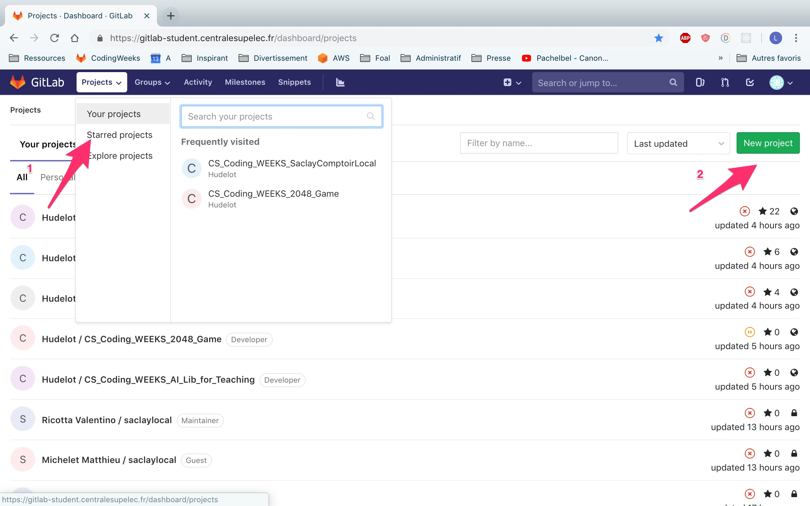
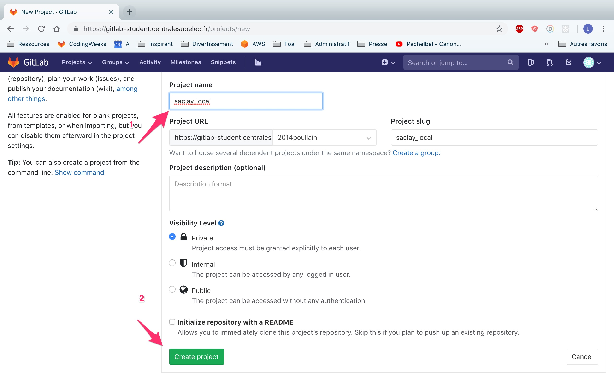
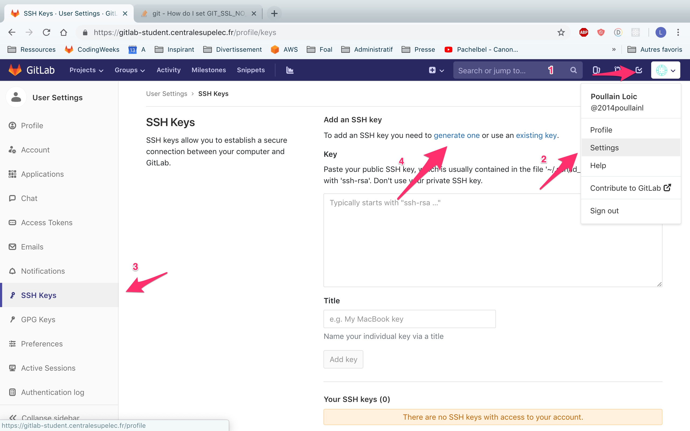
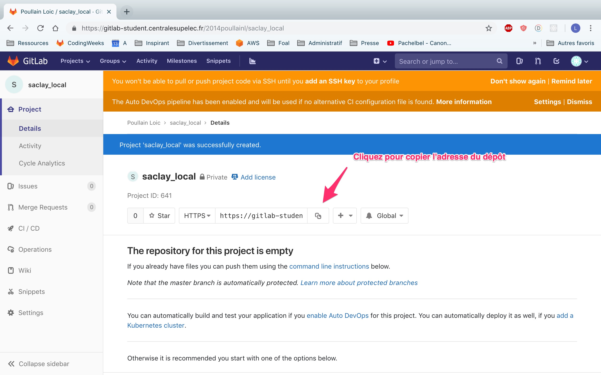

# Configurer un dépôt Gitlab à plusieurs

Ce document explique comment configurer un dépôt Gitlab à plusieurs.

Votre groupe est composé de plusieurs personnes : A et B1, B2, B3, etc.

## Consignes pour la personne A

Allez sur Gitlab et créez un dépôt si ce n'est pas déjà fait. Le depôt est la "boîte" qui va contenir le code de votre projet. Voici comment faire :




Vous allez maintenant ajouter vos co-équipiers et vos encadrants (Loïc Poullain et Céline Hudelot) comme collaborateur de votre dépôt. Pour cela, allez sur votre depôt GitLab et choisissez le menu Settings | Members dans la fenêtre de gauche. Ajouter vos co-équipiers et vos enseignants comme collaborateurs. Vos collègues seront *Maintainer* et vos enseignants seront *Reporter*.

## Consignes pour toutes les personnes

### Créer une paire de clés SSH (RSA)



Une fois que vous aurez cliqué sur `generate one`, suivez le tutoriel pour en créer une. Lorsque vous générez la clé, laissez tous les champs vides. Pressez juste "Entrée" à chaque fois.

Vous pouvez ensuite afficher votre clé publique via (attention sur Windows, utilisez le Git bash ou le PowerShell):

```bash
cat ~/.ssh/id_rsa.pub
```
Copiez-la ensuite dans le grand rectangle.

### Cloner le dépôt en locale

Chacun de votre côté va maintenant devoir copier le dépôt sur son ordinateur. Ouvrez pour cela un terminal.

Une fois fait, placez-vous dans le dossier (aussi appelé répertoire) où vous voulez créer votre projet (il peut s'agir du bureau, de mes documents, etc).

> Pour se placer à la racine d'un dossier, il faut utiliser la commande `cd` (normalement vue en SIP).
>
> `cd my_dir` <=> aller dans le sous-dossier `my_dir`
>
> `cd ..` <=> aller dans le dossier  parent

Allez sur Gitlab récupérer l'adresse web de votre dépôt.



Et maintenant clonez le dépôt dans votre machine (ne le faites pas dans un dossier où il y a déjà des fichiers...)

> git clone l_adresse_de_votre_depot

Un nouveau dossier devrait apparaître avec votre code inclus dedans. Vous pouvez maintenant faire vos commits et "pusher" vos versions sur Gitlab.

### Erreurs courantes

#### Echec d'authentification

```
fatal: Échec d'authentification pour 'https://xxxx/'
```

Vous utilisez l'URL en HTTPS. Passez pas l'URL SSH :

```bash
git clone git@xxxx
```

#### Dépôt non trouvé

```
fatal: le dépôt 'git@xxxx/' n'existe pas
```

Enlevez le slash à la fin.

#### Pas de branche master

Si vous obtenez l'erreur `Couldn't find ref remote master`, allez sur le Gitlab (dans le navigateur web) et créez un fichier random (par exemple README.md).

## Commandes usuelles de Git

Voici quelques rappels des commandes git les plus courantes

```sh
git status # afficher les fichiers qui sont sélectionnés pour être commités et ceux qui ne le sont pas.
git diff # afficher les modifications depuis le dernier commit
git add my_file_name # ajouter un fichier dans la zone de transit
git commit -m "A message that describes the commit" # créer un commit à partir des fichiers dans la zone de transit.
# Il s'agit d'une sauvegarde (d'une version) de votre code. Partager votre code revient à transmettre des commits.
git push origin master # envoyer vos commits sur le serveur
git pull origin master # récupérer les commits du serveur
```
